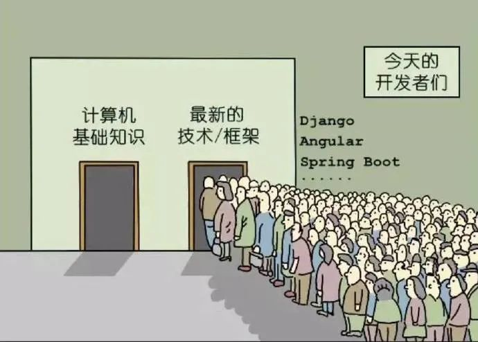

# 原力注入 Linux 从入门到精通

回归技术本质，即回归到底层技术以及细节上！

## 教程
- **极简 Linux 入门使用教程**
	- [**背景介绍**](getting_started/background.md)
	- [**Shell 入门**](getting_started/shells.md)
	- [**文本编辑器入门**](getting_started/text-editors.md)
	- [**杂项**](getting_started/miscellaneous.md)

## Process
- [**理解 Linux 中的进程状态**](process/Understanding_process_states_in_Linux.md)/[**英文**](process/Understanding_process_states_in_Linux.pdf)
- [**Linux 二进制文件格式 ELF 101**](elf_101.md)

## FileSystem
- [**Linux `inotify` 简介**](fs/What_is_inotify.md)
	- [**进程 inotify 以及 inotify watches 统计**](fs/inotify_stat.sh)
	- [**监视目录下文件创建或者修改示例**](fs/inotify_monitor_path.sh)
- [**OverlayFS 简介**](fs/OverlayFS.md)
- [**使用 `autofs` 实现 `mount --bind ` 自动挂载**](fs/autofs.md)

## Systemd
- [**如何在 Linux 中创建 Systemd 服务**](systemd/Systemd_Service_Creation_Guide.md)

## Shell
- [**Linux `set` 命令详解**](shell/Linux_set_Command_Explained.md)
- [**清理多余安装的 kernels**](shell/remove_old_kernels.sh)
- [**Linux 删除文件错误处理**](shell/rm_failed.md)

## 网络
- [**Linux 网络优化之网卡及内核相关参数**](net/net_optimize_cmd.md)
- [**Broadcom Ethernet Network Adapter User Guide**](net/broadcom-ethernet-network-adapter-user-guide.pdf)
- [**超赞！Linux Network Stack**](net/linux_network_stack_en.pdf)
- [**TCP 统计信息详解**](net/tcp_netstat-s_explained.md)

## 安全
### 证书
- [**安全证书简介**](security/certs_intro.md)
- [**Deep Dive into SSL certificates**](security/ssl_certs.md)

## 内核
- [**Linux 异步 I/O 框架 io_uring：基本原理、程序示例与性能压测（2020）**](https://arthurchiao.art/blog/intro-to-io-uring-zh/)
- [**Awesome io_uring**](https://github.com/espoal/awesome-iouring)
- [**管理内核驱动和模块**](kernel/kernel_adminstration_cn.md)

## 参考书
- [**现代 CPU 性能分析与优化**](https://weedge.github.io/perf-book-cn/zh/)
