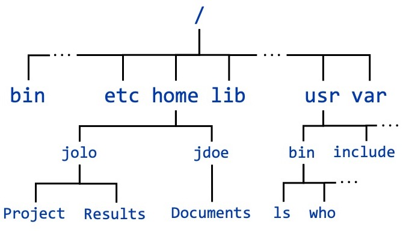

# Miscellaneous and Tips

This topic covers connecting to and using remote Linux machines (such as TACC systems). It includes typical usage scenarios like setting file permissions and copying files between systems. It also includes pertinent background information such as typical Linux filesystem organization, the role of the root user, how software is installed, and how to use storage volumes.

## Accounts

A user account is required for a user to log into any Linux system. An account typically includes identity information such as username, password, user id (UID), and group identifier (GIDs) so that the system can identify the user. An account will also include a set of resources such as accessible disk space that the user can work in, typically called a home directory and information about the default shell preference.

### Username

Every account in a Linux system is associated with a unique username, which is typically a sequence of alphanumeric characters at least three characters in length. It is case sensitive; for example, `Apple01` is a different username than `apple01`. A unique integer, the user id (UID), is assigned to each username. Linux uses the UID rather than the username to manage user accounts since it is more efficient to process numbers than strings. However, you don't necessarily need to know your UID.

### Group

Linux also has the notion of a group of users who need to share files and processes. Each account is assigned a primary group with a numerical group id (GID) that corresponds to the particular group. A single account can belong to many groups, but you may have only one primary group. Groups can also be used to assign certain permissions to users on the system.

### Password

Each username requires a password. The username is the account identifier, and the password is the authenticator. A password is required for operations such as logging into the system and accessing files. Password requirements differ between systems; a sample requirement is that the password must be a minimum of 8 characters with at least 3 of the following character classes:

*   lower-case letters
*   upper-case letters
*   numerical digits
*   punctuation

When you enter your password, the system encrypts it and compares it to a stored string. This ensures that even the Operating System does not know your plain text password. This method is frequently used on websites and servers, especially those that run Linux. Once you have the system username and password, you are ready to log into the remote system using a secure shell (`ssh`). See the [remote connections](#remote-connections) page for details about SSH.

## <span id="remote-connections">Remote Connections</span>

### Connect Remotely with `ssh`

**S**ecure **SH**ell (SSH) is designed to be a secure way to connect to remote resources from your local machine over an unsecured network. The following example uses an account with username "jolo" using SSH to log into a machine named "foo.edu":

```bash
$ ssh [email protected]
```

This will open a connection to the remote machine "foo.edu" and log in as the user if authentication is successful. If you [log into Stampede3](https://docs.tacc.utexas.edu/hpc/stampede3/#access) via SSH, a password and/or private key will be required for authentication. The above example is the most straightforward version of the command, but there are many additional options. For example, to use a [key pair](https://www.ssh.com/ssh/public-key-authentication) (where `my_key` is the name of the private key file) to login, then the command will look like:

```bash
$ ssh -i my_key [email protected]
```

Another common option is [X11](https://en.wikipedia.org/wiki/X_Window_System) forwarding, which can be achieved using the `-X` or `-Y` flags. X11 forwarding is useful when you are going to use applications that open up outside of the shell. For more information on this and other options, see the man page for `ssh`.

#### SSH setup

In order to access a Linux system via `ssh`, you will need an ssh client and a terminal program on your system. Sometimes these are included in a single application for simplicity. There are many different terminals available, but here are a few examples:

*   On Linux, simply open your terminal emulator and enter `ssh` commands
*   On Mac OS, the Terminal app is included with the system, and `ssh` can be invoked from the command line in the Terminal app
*   On Windows:
    *   The Linux Bash Shell is available as the [Windows Subsystem for Linux](https://docs.microsoft.com/en-us/windows/wsl/about) and supports many Linux commands, including `ssh`
    *   One commonly-used terminal and ssh client combo is [PuTTY](https://www.chiark.greenend.org.uk/~sgtatham/putty/latest.html)
    *   Another terminal and ssh client combo is [MobaXterm](https://mobaxterm.mobatek.net/)

### Securely Copy with `scp`

**S**ecure **C**opy **P**rotocol (SCP) is based on the SSH protocol, and is used for securely copying files across the network.

#### Copy to a remote resource

Say you have a file "code.c" located in your current directory on your local machine that you want to copy **to a remote resource** in the "Project" directory under your home directory on the remote machine (we'll stick with the user "jolo" and "foo.edu"). This can be done using `scp` as follows:

```bash
$ scp code.c [email protected]:~/Project
```

#### Copy from a remote resource

Alternatively, if you want to copy the file "output.txt" **from a remote resource** located in the "Project" directory to the directory "Results" on your local machine _and rename the file_ to "Run12\_data.txt" during the move:

```bash
$ scp [email protected]:~/Project/output.txt ./Results/Run12_data.txt
```

Similar syntax can be used to copy from a remote host to another remote host as well. The `-r` option can be used to copy full directories recursively. For more options, see the `scp` man page.

#### SCP setup

To use `scp` with a remote system, similar to `ssh`, you will need a program to support it. Here are a few examples:

*   On Linux, open your terminal emulator and enter `scp` commands
*   On Mac OS, open the Terminal app and enter `scp` commands
*   On Windows:
    *   The [Windows Subsystem for Linux](https://docs.microsoft.com/en-us/windows/wsl/about) supports many Linux commands, including `scp`
    *   From the developers of PuTTY, you can use [PSCP](https://www.chiark.greenend.org.uk/~sgtatham/putty/latest.html)
    *   [MobaXterm](https://mobaxterm.mobatek.net/) comes with a built-in SCP client

If you are expecting to copy large files to or from remote locations, note that File and Directory Compression will be covered later in this tutorial, under [Optional Topics](#optional-topics).

## Filesystem

As we discussed previously, Linux has a hierarchical filesystem. The files and directories form a tree structure, in accordance with the [Filesystem Hierarchy Standard (FHS)](https://en.wikipedia.org/wiki/Filesystem_Hierarchy_Standard). The topmost directory is the root directory `/` and all directories are contained within or below this directory in the hierarchy. There are several directories within the root directory – called subdirectories – that are generated upon installation of a Linux distribution. Many of these are used exclusively by the system. There are also some generated for use by users, where subdirectories can be created without elevated permissions.



A sample portion of the filesystem structure tree

The FHS includes descriptions of the core directories in the hierarchy, causing this structure to be relatively standard across Linux systems. The table provides a list of the major subdirectories of the root directory `/`. There is no need to remember the purpose of every directory unless you are working at a lower level within a Linux system. Rather, this table should give you an idea of the basic layout of a Linux filesystem and possibly serve as a useful reference in the future.

Based in part on content from [Debian](http://l.github.io/debian-handbook/html/en-US/sect.filesystem-hierarchy.html) and up-to-date with FHS 3.0

| **Directory** | **Contents** |
|---|---|
| **bin** | Binary files for command execution |
| **boot** | Files for the [boot loader](https://en.wikipedia.org/wiki/Booting#Modern_boot_loaders) |
| **dev** | [Device files](https://en.wikipedia.org/wiki/Device_file) for interacting with devices connected to the system |
| **etc** | System configuration files |
| **home** |  User home directories |
| **lib** |System shared libraries needed by binaries in `bin` and `sbin` |
| **media** |Location for temporarily mounting filesystems from replaceable media |
| **mnt** | Location for temporarily<br>                mounting filesystems<br>             |
| **opt** | Optional application software packages |
| **proc** | [Virtual filesystem](https://en.wikipedia.org/wiki/Virtual_file_system) for process and system information |
| **root** | Home directory of root user |
| **run** | Run-time variable data since last boot |
| **sbin** | System binary files for command execution |
| **srv** | Data for services provided by the system |
| **sys** | Virtual directory for system information |
| **tmp** | Temporary files |
| **usr** | Read-only user data for all users; Some important subdirectories include:<br> * `/usr/bin` - program binaries<br> * `/usr/include` - [include files](https://en.wikipedia.org/wiki/Include_directive)<br> * `/usr/lib` - libraries for binaries in /`usr/bin` and `/usr/sbin`<br> * `/usr/local` - local host data<br> * `/usr/sbin` - Non-essential system binaries<br> * `/usr/share` - shared data, such as documentation<br> * `/usr/src` - kernel source code and headers<br> |
| **var** | Variable data |

Most of the work you do will likely be performed in your home directory while on a Linux system, while programs you use will reside in other locations, as explained above. You may want to familiarize yourself with the [Stampede3 Filesystem](https://docs.tacc.utexas.edu/hpc/stampede3/#files) as well as how to [navigate it](https://docs.tacc.utexas.edu/hpc/stampede3/#files-filesystems) if you are planning on doing work there. Also feel free to peruse [Optional Topics](#optional-topics) in a later section for more information on the root user and mounts.

## File Permissions

Linux is a multi-user environment where many users can run programs and share data. File permissions are used to protect users and system files by controlling who can **read**, **write**, and **execute** files. The types of permissions a file can have are:

Types of permissions a file can have.

| **Read Permissions** | **Write Permissions** | **Execute Permissions** |
|---|---|---|
| r | w | x |


Furthermore, files and directories have 3 levels of permissions: **User**, **Group** and **World**. When displayed, permissions are arranged into three sets of three characters each. The first set is the User (owner) permissions, the second is Group permissions, and finally, permissions for Others or everyone else on the system (World). In the following example, the owner can read and write the file, while group and all others have read access only.

File permissions example: owner can read and write, while group and others have read access only.

| **User (owner)** | **Group** | **Others (everyone else)** |
|---|---|---|
| rw- | r-- | r-- |


### Displaying File Permissions

You can view a file's permissions by using the "long list" option `ls -l`, which outputs the permissions as a character string at the beginning of the row for each file or directory. The string will begin with a `d` for a directory or a `-` for a file. The next nine characters refer to the file permissions in the order discussed above. Other information included per row of the output is (in order) links to the file, username of the owner, group, file size, date and time of last edit, and filename. For example:

```bash
$ ls -l $HOME
-rw-r--r-- 1 jdoe jdoe            796631 2009-11-20 14:25 image_data.dat
-rwxrwxr-- 1 jdoe community_group 355    2010-02-18 15:50 my_script.sh
```

In this example, user "jdoe" owns the two files: "image\_data.dat" and "my\_script.sh". For the first file, we can tell that "jdoe" has read and write access (but not execute permissions) because of the `rw-` in the `-**rw-**r--r--` character string on that row. Similarly, we can see that the group only has read access (`-rw-**r--**r--`) and all others on the system only have read access (`-rw-r--**r--**`). The second file can be read, written, and executed by "jdoe" and others who are in the "community\_group".

### Changing File Permissions

You can use the `chmod` command to change permissions on a file or directory (use `chmod -R` for recursive). This command changes the file permission bits of each file according to a given mode, which can be either a symbolic representation (characters) of changes to be made or an octal number representing the bit pattern for the new mode bits.

#### Symbolic Mode

The syntax of the command in symbolic mode is
```bash
chmod [references][operator][modes] file
```

*   **references** can be "u" for user, "g" for group, "o" for others, or "a" for all three types
*   **operator** can be "+" to add, "-" to remove permissions, and "=" to set the modes exactly
*   **modes** can be "r" for read, "w" for write, and "x" for execute

In the following example, we are giving the owner read, write, and execute permissions, while the group and everyone else is given no permissions.

```bash
$ chmod u+rwx my_script.sh
    
$ ls -l my_script.sh
-rwx------ 1 jdoe community_group     355 2010-02-18 15:50 my_script.sh
```    

The `u+` _adds_ permissions for the user, and the `rwx` specifies _which permissions_ to add. A common use for this method is to make a script that you have written executable. The command `chmod u+x my_script.sh` will make the script executable by the owner. Once you have changed the permissions, you can run the script by issuing `./my_script.sh`.

Alternatively, you can run a script with the `source` command, in which case it is not necessary for the script file to be executable. However, be aware that doing `source my_script.sh` will run the commands from `my_script.sh` as if you were typing them into the current shell. Thus, any variables defined or changed in the script will remain defined or changed in your current shell environment, unlike what happens when you run an executable script, which does not affect your current environment.

#### Numeric Mode

Numeric mode uses numbers from one to four octal digits (0-7). The rightmost digit selects permissions for the World, the second digit for other users in the group, and the third digit (leftmost) is for the owner. The fourth digit is rarely used.

The value for each digit is derived by adding up the bits with values 4 (read only), 2 (write only), and 1 (execute only). For example, to give read and write permissions, but not execute permissions, you would use a 6. The value 0 removes all permission for the specified set, whereas the value 7 turns on all permissions (read, write, and execute).

Let's say you have an executable that you would like others in your group to be able to read and execute, but you do not want anybody else to be able to have any access. First you need to set the read, write, and execute permission for yourself (7), then give read and execute to your group (5), and finally no permissions for everybody else (0). So the full number you would use is 750.

```bash
$ ls -l my_script.sh
rw-r--r-- 1 jdoe community_group     355 2010-02-18 15:50 my_script.sh
    
$ chmod 750 my_script.sh
    
$ ls -l my_script.sh
-rwxr-x--- 1 jdoe community_group    355 2010-02-18 15:50 my_script.sh
```

For more on user permissions, see _Root and Sudo_ later in [Optional Topics](#optional-topics).

## <span id="optional-topics">Optional Topics</span>

### File and Directory Compression

Compression in Linux typically involves packing collections of files into an archive using the [`tar`](https://en.wikipedia.org/wiki/Tar_(computing)) command, which gets its name from **t**ape **ar**chive. Files or directories can be packed into a single tar file, as well as compressed further either the `-z` option to tar or other programs. The `-c` flag is used to **c**reate an archive and the `-x` flag is for e**x**tracting an archive. The `-v` option enables **v**erbose output, and `-f` specifies to store as an archive **f**ile. By default, directories are added recursively, unless otherwise specified. Here is an example of creating an archive or tar file:

```bash
$ tar -cvf my_archive.tar file1 file2 file3
file1
file2
file3
```

And to extract the same archive (not verbose):

```bash
$ tar -xf my_archive.tar
```

A program commonly used along with `tar` is [`gzip`](https://en.wikipedia.org/wiki/Gzip), which creates archives with the extension `.gz`. A file can be compressed simply by `gzip file` (with an added `-r` for a directory) _or_ a `.tar.gz` file can be created (or extracted) by adding the `-z` option to a `tar` command. For example, the same command from above to extract with `gzip`:

```bash
$ tar -xzf my_archive.tar.gz
```

Another common extension for a gzipped tar file is .tgz.

For more on compression, see this [detailed article](https://www.digitalocean.com/community/tutorials/an-introduction-to-file-compression-tools-on-linux-servers).

### Symbolic Links

Symbolic links are a special type of file which refer to another file in the filesystem. The symbolic link contains the location of the target file. Symbolic links are used to provide pointers to files in more than one place and can be used to facilitate program execution, make navigating on the system easier, and are frequently used to manage system library versions. To make a symbolic link:

```bash
$ ln -s data/file/thats/far/away righthere
```

See the man pages for `ln` for more information on linking files.

### Root and Sudo

The **root** user on any system is the administrative account with the highest level of permissions and access. This account is sometimes referred to as the [superuser](https://en.wikipedia.org/wiki/Superuser). By default, most Linux systems have a single root account when installed and user accounts have to be set up. The root account has a UID of 0, and the system will treat any user with a UID of 0 as root.

If you have access to a root account on any Linux system, best practice is to _only use this account when the privileges are needed_ to perform your work (such as installing packages), and to use a user account for all of your other work. Note that the root directory is _not_ the home directory of the root user, but rather the root of the filesystem. The home directory of the root user is actually located at `/root`.

The program **sudo** allows users to run commands with the equivalent privileges of another user. The default privileges selected are the root user's, but any user can be selected. A user with sudo privileges can run commands with root privileges without logging in as root (must enter user's password) by putting `sudo` in front the command. The first user account created on some Linux distributions is given sudo privileges by default, but most distributions require you to specifically give sudo privileges to a user. This is typically done by editing the `/etc/sudoers` file (requires either root or sudo access), or running a command like `usermod`.

### Package Managers

The root user and any user with sudo privileges have full access to the features of a [package manager](https://en.wikipedia.org/wiki/Package_manager). In short, [packages](https://en.wikipedia.org/wiki/Package_format) are archives of software and associated data, and a package manager is used to install, uninstall, and manage packages on a system. They are used in the shell or through a GUI, and have varying features. Most Linux distributions have a default package manager installed with the system. Some common package managers available are:

*   [APT](https://en.wikipedia.org/wiki/APT_(Debian)), which includes:
    *   apt
    *   aptitude
    *   apt-get
    The Debian-recommended CLI choice is `apt`; see [this article](https://debian-handbook.info/browse/stable/sect.apt-get.html) for a detailed explanation.
*   [Synaptic](https://en.wikipedia.org/wiki/Synaptic_(software)) - a GUI for APT
*   [dpkg](https://en.wikipedia.org/wiki/Dpkg)
*   [yum](https://en.wikipedia.org/wiki/Yum_(software))
*   [pacman](https://en.wikipedia.org/wiki/Arch_Linux#Pacman)

Commands for these package managers can be found in their supporting documentation or via the man pages. Note that on a managed resource, the availability of user software is often managed through [the Module Utility](/environment/module/intro).

### Mounting Storage Volumes or Devices

The `mount` command can be used to attach the filesystem of another device at a specified place in the directory tree for easy read/write access. `mount` with no arguments is useful for seeing what devices are mounted. Typically, you must specify the [type](https://en.wikipedia.org/wiki/File_system#Types_of_file_systems) of the filesystem, name of the [device](https://www.dell.com/support/kbdoc/en-us/000132092/ubuntu-linux-terms-for-your-hard-drive-and-devices-explained#Linux_device_naming_convention), and the path to where you want to mount it:

```bash
mount -t [type] [device] [path]
```

Use the `umount` command to unmount a device's filesystem. It has similar options to `mount`, and both commands have thorough man pages. Another way to mount a device is to use [`fstab`](https://help.ubuntu.com/community/Fstab), which automates the process. Network shares can be mounted as well, so long as appropriate credentials are supplied to connect.