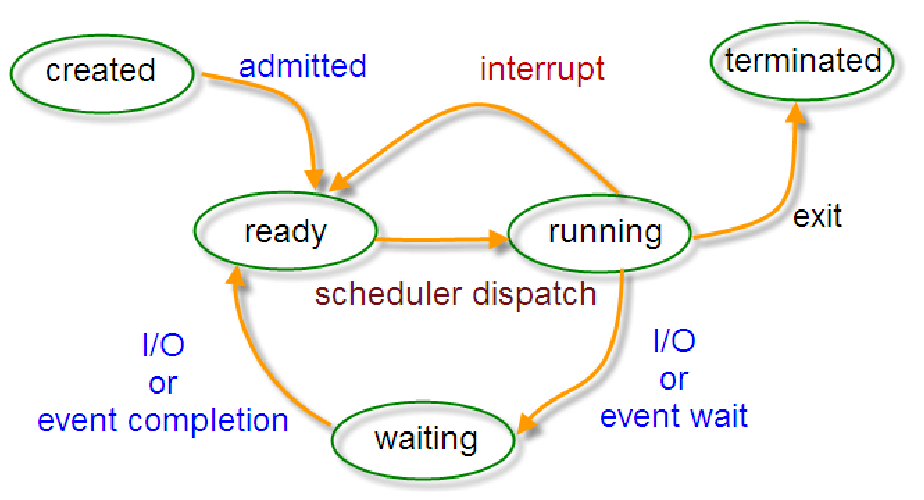

# 理解 Linux 中的进程状态

_S. Parthasarathy, drpartha@gmail.com_

**版本：20191030a**

## 摘要

理解“进程”及其“状态”的概念对于清晰了解 Unix/Linux 的工作方式至关重要。本文使用一个常见的类比来解释这些概念。

## 1. 背景和术语

背景：在 Linux 及许多 Unix 系统中，进程是一个可执行程序的实例。由于 Linux 是一个多用户系统，意味着不同用户可以在系统上运行各种程序，内核必须唯一地标识每个运行实例。内核将程序识别为“进程”。

## 1.1 什么是进程？

程序在创建时通常是存储在某种介质中的文件。因此，程序是一个被动的实体，直到它被启动为止，进程可以被认为是一个“正在运行的程序”。Unix/Linux 在程序能被操作系统处理之前为其添加了许多细节。一个裸程序以及所有必要的细节现在可以被称为“进程”。它由程序指令、从文件中读取的数据、其他程序或系统用户的输入组成。

因此，“程序”和“进程”之间存在细微差别。我们将使用类比来解释这种差异。我们可以将“程序”比作一辆单独的汽车。进程就像是交通系统中的汽车，详情见下文。

在每种 Unix 系统中，Linux 的进程可以处于多种状态。以下是进程的简化视图。



进程是动态实体，因为它们的机器代码指令由 CPU 执行。Unix 及其后继版本 Linux 是多任务操作系统。


多任务系统允许多个进程同时运行而互不干扰。这种“魔法”之所以发生，是因为进程可以根据其自身以及其他竞争进程的情况动态改变状态。

**类比**：我们可以将上述情况比作汽车。为了理解交通管理，我们必须研究汽车的行驶过程。在创建时，汽车只是一块金属，准备好开动但当前还停在工厂仓库。这类似于一个可执行程序被动存储在文件中。有人必须加油、启动汽车，并将其开到最近的道路上。现在汽车可以比作一个进程。可能还有许多其他汽车在路上，只要它们遵守交通规则，它们都可以前进。在这种情况下，所有汽车都在不同的状态之间不断切换。一辆汽车可以处于任何一个挡位或刹车位置。类似地，进程可以处于不同的状态。汽车可以在任何给定时间实际移动或静止（仅怠速）。

**进程状态**：进程在其生命周期中会经过多个阶段，从创建到退出。每个阶段可以称为进程状态。进程通过内置的信号和陷阱在不同状态之间切换。

**信号和陷阱**：信号是发送给程序的软件中断，表明发生了重要事件。陷阱定义并激活处理程序，以便在进程收到信号或其他特殊条件时运行。

## 1.2 观察进程

Linux 提供了一个强大的工具来监视系统中进程的变化。我们将使用 `ps` 命令观察进程。可以使用以下命令列出系统中所有运行的进程：

```bash
ps -e
```

使用以下命令显示特定命令的状态：

```bash
ps -o pid,state,command
```

示例：

```bash
drpartha@vostro3558:~> ps -o pid,state,command
PID   S   COMMAND
2775  R   ps -o pid,state,command
```
上面输出中的第一列（PID）是分配给每个进程的唯一编号。第二列（S）是表示进程状态的单个字母，可能是以下之一：

- **R**：可运行或正在运行状态
- **D**：不可中断的休眠（通常是 IO 操作）
- **S**：可中断的休眠（等待事件完成）
- **Z**：僵尸进程，已终止但未被父进程回收
- **T**：停止状态，由作业控制信号或调试器控制导致

进程通常以 R 状态开始，并在被父进程回收后结束。

此外，可以使用 `top` 命令动态观察所有进程的状态变化。命令 `pstree` 则可以显示进程的父子关系树。

# 2. Linux 的进程状态

汽车在路上的情况可以总结为如下图所示。该图展示了每辆车在任意时刻的状态。我们将在后续讨论中交替使用汽车或进程这一术语。


该图高度简化了概念，但展示了大多数关键点。更复杂的状态图可以参考其他文献。现代计算机中，任何时刻可能同时有多个进程并发运行。每个进程会根据其他进程的状态不断在各种状态之间切换。

## 2.1 R 状态

R 状态：可运行状态或运行状态。进程在内存中，准备运行。通过 `fork` 命令，Unix/Linux 中的进程可以由另一个进程创建（诞生）。进程处于 R 状态时，可以在 CPU 上争夺运行时间。当它获得 CPU 时间后，可以切换到其他状态。

## 2.2 T 状态

T 状态：停止状态，由作业控制信号或调试器控制。类似于汽车停在路上。

## 2.3 D 状态

D 状态：不可中断的休眠状态。类似于汽车在等待行人过马路。

## 2.4 S 状态

S 状态：休眠状态，等待事件发生。类似于汽车在等红绿灯。

## 2.5 Z 状态

Z 状态：僵尸状态，进程已终止但未被父进程回收。进程的 PID 和退出码仍保留在内存中，等待父进程调用 `wait()`。

# 3. 状态转换

## 3.1 R → T 和 T → R 的转换

汽车可以开始移动，或者可能因为某些原因而停止。准备运行的程序可以开始执行指令，或者可能暂停执行（最终会恢复）。

## 3.2 R → D 和 D → R 的转换

## 3.3 R → S 和 S → R 的转换

## 3.4 R → Z 的转换

进程通过执行exit系统调用而终止。然后父进程应该执行wait()系统调用来读取死亡进程的退出状态和其他信息。在调用wait()之后，僵尸进程会完全从内存中移除（被收割）。汽车不再是交通系统的一部分。

# 4 结论

这是一个相当复杂主题的非常简化的描述。汽车的类比不应该被过度延伸。

强烈推荐一个更全面和清晰的指南，可在[8]找到。

您可以将建设性的建议和意见发送至：drpartha@gmail.com。

# 参考文献

- [1] L. Lamport, LaTeX: A document preparation system, Pub.: Addison Wesly, 1986 (The LaTeX bible)
- [2] M Goossens, F Mittelbach, A Samarin, The LATEX Companion, Pub.: Addison Wesley, 1994. (The LaTeX gospel)
- [3] Nicolas Markey, Tame the beast, URL http://tug.ctan.org/texarchive/info/bibtex/tamethebeast/ttb en.pdf
- [4] Linux Signals Fundamentals
- [5] Marek, Linux process states, https://idea.popcount.org/2012-12-11-linux-process-states/
- [6] Tutorialspoint, Unix / Linux Signals and Traps, https://www.tutorialspoint.com/unix/unix-signals-traps.htm
- [7] Bach J Maurice, The design of the Unix operating system, Pub.: Prentice Hall.
- [8] All You Need To Know About Processes in Linux [Comprehensive Guide], https://www.tecmint.com/linux-process-management/
